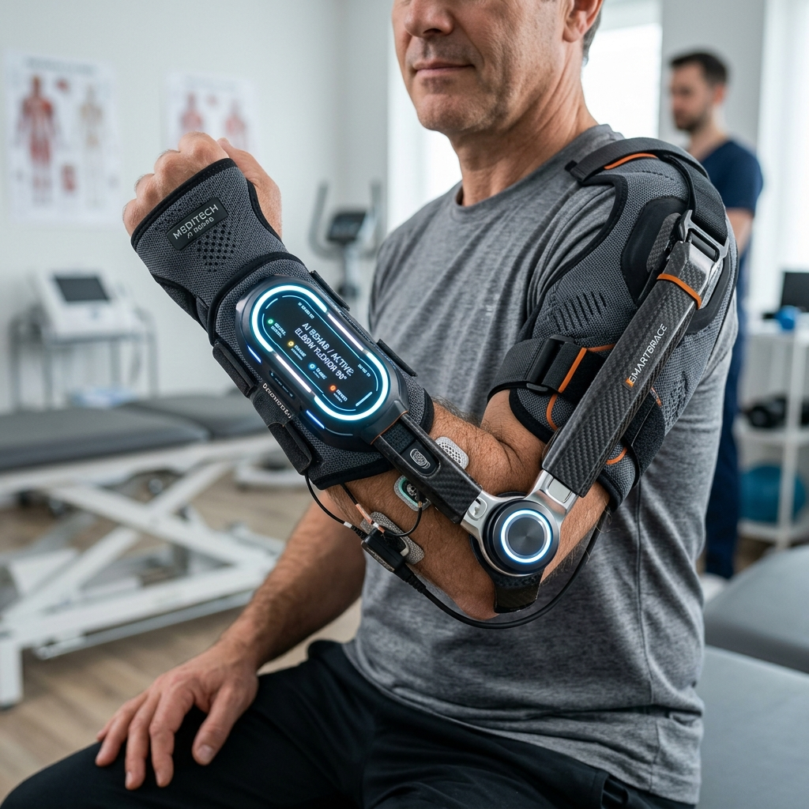
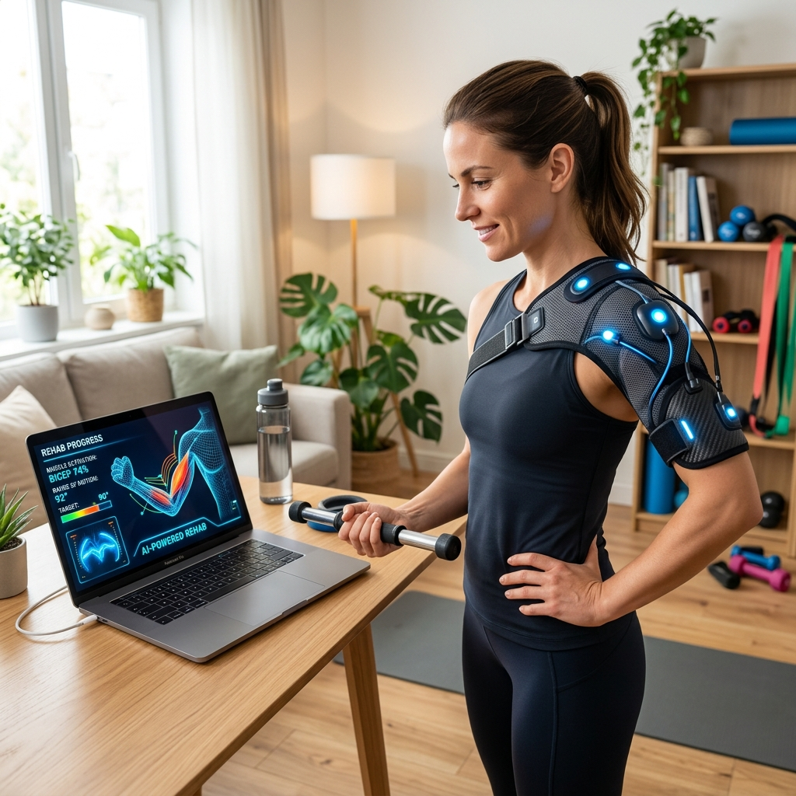
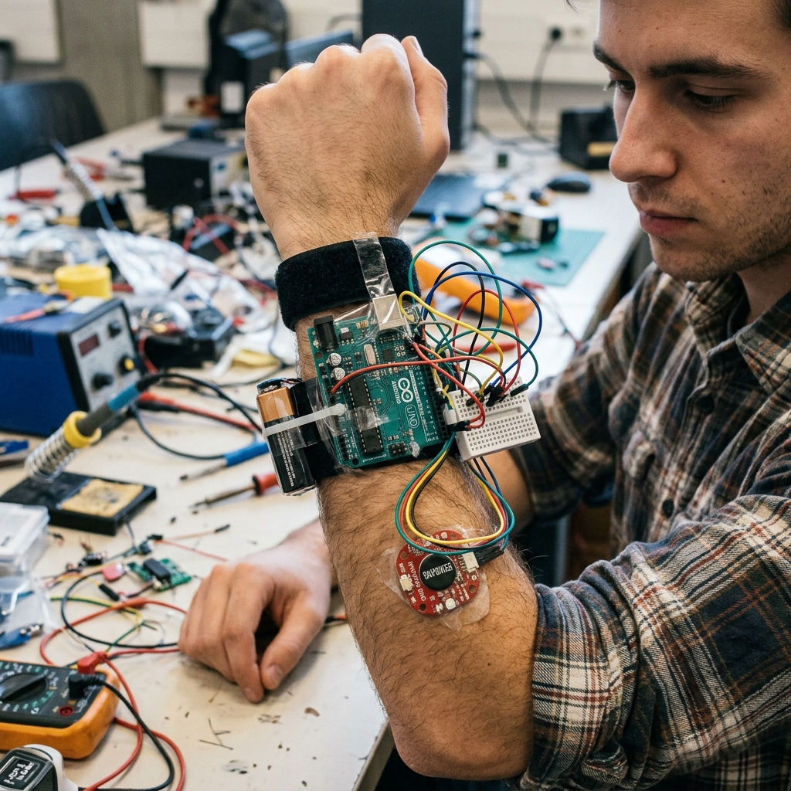

# 🦾 Thiết kế Ý tưởng: Smart AI Rehab Brace

> Đây là bản phác thảo ý tưởng thiết kế cho thiết bị **Băng đeo/Nẹp tay trị liệu thông minh tích hợp AI**, giải pháp tối ưu thay thế cho cánh tay robot phức tạp để đảm bảo tính khả thi trong 20 ngày.

## 🎯 Điểm khác biệt so với thiết bị y tế truyền thống:

1. **Thiết kế mỏng nhẹ (Sleek & Wearable):** Không cồng kềnh như máy CPM cơ khí. Thiết bị dùng vải thoáng khí và sợi carbon, giúp bệnh nhân đeo cả ngày mà không khó chịu.
2. **Cảm biến sinh học (Bio-sensors):** Các điểm tiếp xúc màu sáng ở mặt trong của đai là các điện cực EMG. Chúng chạm trực tiếp vào da để đọc tín hiệu điện từ cơ bắp.
3. **Mô-đun AI Core:** Khối xử lý trung tâm (nơi có đèn LED) sẽ thu nhận tín hiệu nhiễu từ cơ bắp, chạy thuật toán Machine Learning (ví dụ: tối ưu bằng OpenVINO) để:
   - Phát hiện cơn co thắt/chuột rút (để ngắt trợ lực bảo vệ tay).
   - Đọc ý định vận động (để kích hoạt motor trợ lực đúng lúc).
   - Đo lường mức độ mỏi cơ (tần số EMG giảm) để cảnh báo dừng tập.

*Đây là một "Form factor" (kiểu dáng) lý tưởng nhất để thuyết phục ban giám khảo về tính khả thi, dễ thương mại hóa và ứng dụng AI thực chất.*

## 📸 Hình ảnh Use-Case (Ngữ cảnh sử dụng):

> Minh họa người bệnh đang tập phục hồi chức năng tại nhà. Thiết bị kết nối truyền tín hiệu EMG không dây về laptop (để mô hình AI tối ưu bằng OpenVINO phân tích và hiển thị lên màn hình).

## 🛠️ Hình ảnh Prototype Thực tế (Thiết thực cho sinh viên làm trong 20 ngày):

> Các bức ảnh trên mang tính "Concept" tương lai. Còn đây là hình ảnh thực tế của một bản **Prototype (Sản phẩm mẫu)** mà team bạn hoàn toàn có thể tự hàn mạch và code trong 20 ngày. Nó bao gồm: Đai dán Velcro đơn giản, bo mạch vi điều khiển (như Arduino/ESP32) lộ ra ngoài, dây cắm (jumper wires) và cảm biến điện cơ (EMG) dính trực tiếp lên da. Ban giám khảo cực kỳ đánh giá cao những prototype "trông có vẻ tự làm" (DIY) như thế này vì nó chứng minh sự nỗ lực kỹ thuật thật sự của team.

